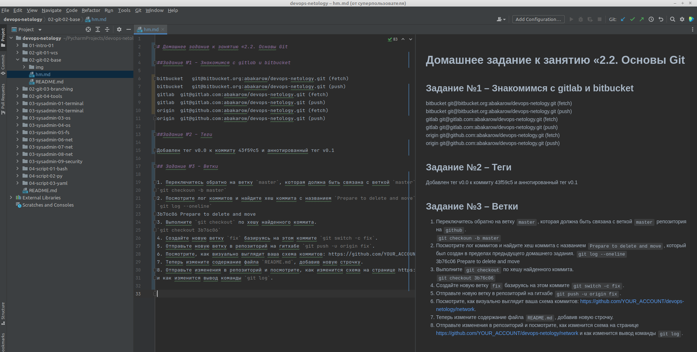

# Домашнее задание к занятию «2.2. Основы Git  

## Задание №1 – Знакомимся с gitlab и bitbucket  

bitbucket	git@bitbucket.org:abakarow/devops-netology.git (fetch)      
bitbucket	git@bitbucket.org:abakarow/devops-netology.git (push)  
gitlab	git@gitlab.com:abakarow/devops-netology.git (fetch)  
gitlab	git@gitlab.com:abakarow/devops-netology.git (push)  
origin	git@github.com:abakarow/devops-netology.git (fetch)  
origin	git@github.com:abakarow/devops-netology.git (push)  

## Задание №2 – Теги 

Добавлен легковесный тег `v0.0` к коммиту `43f59c5` и аннотированный тег v0.1

## Задание №3 – Ветки 

1. Переключитесь обратно на ветку `master`, которая должна быть связана с веткой `master` репозитория на `github`.  
`git checkoun -b master`  
2. Посмотрите лог коммитов и найдите хеш коммита с названием `Prepare to delete and move`, который был создан в пределах предыдущего домашнего задания.
`git log --oneline`  
3b76c06 Prepare to delete and move  
3. Выполните `git checkout` по хешу найденного коммита.  
`git checkout 3b76c06`  
4. Создайте новую ветку `fix` базируясь на этом коммите `git switch -c fix`.  
5. Отправьте новую ветку в репозиторий на гитхабе `git push -u origin fix`.  
6. Посмотрите, как визуально выглядит ваша схема коммитов: https://github.com/YOUR_ACCOUNT/devops-netology/network.  
7. Теперь измените содержание файла `README.md`, добавив новую строчку.  
8. Отправьте изменения в репозиторий и посмотрите, как изменится схема на странице https://github.com/YOUR_ACCOUNT/devops-netology/network 
и как изменится вывод команды `git log`.

## Задание №4 - Упрощаем себе жизнь 
 
