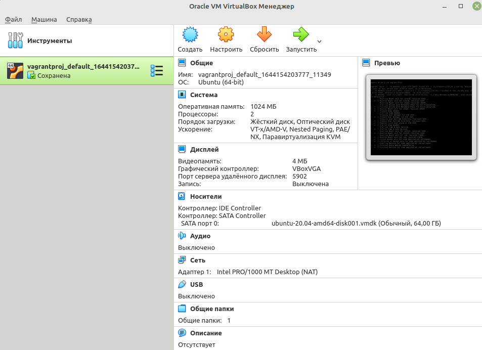

# Домашнее задание к занятию "3.1. Работа в терминале, лекция 1"

1. Установите средство виртуализации:

`   sudo apt install virtualbox
`

2. Установите средство автоматизации:

`curl -fsSL https://apt.releases.hashicorp.com/gpg | sudo apt-key add - `

`sudo apt-add-repository "deb [arch=amd64] https://apt.releases.hashicorp.com $(lsb_release -cs) main"`

`sudo apt-get update && sudo apt-get install vagrant`

3. Работа с Vagrant:

* Создание рабочей папки
* Инициализация
* Правка кода внутри файла 

4. Установка дистрибутива: 

* `vagrant up` - загрузка и установка дистибутива согласно конфигурации
* `vagrant suspend` - остановка с сохранением текущего состояния машины

5. Технические характеристики установленной машины:

6. Добавление ресурсов к ВМ.

* В фаил конфигурации добавить блок кода 

`    config.vm.provider "virtualbox" do |v|
    v.memory = 2048
    v.cpus = 4
end`
* v.memory = 2048 - память
* v.cpus = 4 - проц

7. SSH

>abab@ababPC:~/vagrantproj$ vagrant ssh
Welcome to Ubuntu 20.04.3 LTS (GNU/Linux 5.4.0-91-generic x86_64)

> * Documentation:  https://help.ubuntu.com
> * Management:     https://landscape.canonical.com
> * Support:        https://ubuntu.com/advantage

> System information as of Sun 06 Feb 2022 09:11:48 PM UTC

  >System load:  0.0                Processes:             116
  Usage of /:   11.6% of 30.88GB   Users logged in:       0
  Memory usage: 22%                IPv4 address for eth0: 10.0.2.15
  Swap usage:   0%

>This system is built by the Bento project by Chef Software
More information can be found at https://github.com/chef/bento

8. History

* Длина журнала - HISTFILESIZE
* ignoreboth -  содержит в себе ‘ignorespace - не сохранять строки начинающиеся с символа <пробел>’ и ‘ignoredups - не сохранять строки, совпадающие с последней выполненной командой’

9. 