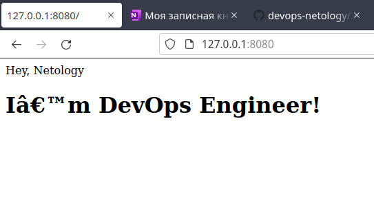

# Домашнее задание к занятию "5.3. Введение. Экосистема. Архитектура. Жизненный цикл Docker контейнера"

## Задача 1

Сценарий выполения задачи:

- создайте свой репозиторий на https://hub.docker.com;
- выберете любой образ, который содержит веб-сервер Nginx;
- создайте свой fork образа;
- реализуйте функциональность:
запуск веб-сервера в фоне с индекс-страницей, содержащей HTML-код ниже:
```
<html>
<head>
Hey, Netology
</head>
<body>
<h1>I’m DevOps Engineer!</h1>
</body>
</html>
```
Опубликуйте созданный форк в своем репозитории и предоставьте ответ в виде ссылки на https://hub.docker.com/username_repo.
## Решение 
- Создан [репозиторий](https://hub.docker.com/repository/docker/abakarow/5.3) 
### Реализация 
- Dockerfile
````
FROM nginx
COPY html /usr/share/nginx/html
````
- Создан index.html в отдельной папке 
- Сборка контейнера 
````
ops@ops-Lenovo-G780:~/5.3.1$ docker build -t nginx_server_abakarow .
Sending build context to Docker daemon  3.584kB
Step 1/2 : FROM nginx
latest: Pulling from library/nginx
31b3f1ad4ce1: Pull complete 
fd42b079d0f8: Pull complete 
30585fbbebc6: Pull complete 
18f4ffdd25f4: Pull complete 
9dc932c8fba2: Pull complete 
600c24b8ba39: Pull complete 
Digest: sha256:0b970013351304af46f322da1263516b188318682b2ab1091862497591189ff1
Status: Downloaded newer image for nginx:latest
 ---> 2d389e545974
Step 2/2 : COPY html /usr/share/nginx/html
 ---> 49f5ee842ccb
Successfully built 49f5ee842ccb
Successfully tagged nginx_server_abakarow:latest

````
- Пробросим 80 порт, запустим машину, проверим работу, запушим в репу 

````
ops@ops-Lenovo-G780:~/5.3.1$ docker run -d -p 8080:80 nginx_server_abakarow
24655a1cab885df61050538169ca157368c96bf0a2060042b39b2dc3d9419c5d
````

````
ops@ops-Lenovo-G780:~/5.3.1$ curl localhost:8080
<html>
<head>Hey, Netology</head>
<body>
<h1>I’m DevOps Engineer!</h1>
</body>
</html>
````



````
ops@ops-Lenovo-G780:~/5.3.1$ docker login -u abakarow
Password: 
WARNING! Your password will be stored unencrypted in /home/ops/.docker/config.json.
Configure a credential helper to remove this warning. See
https://docs.docker.com/engine/reference/commandline/login/#credentials-store

Login Succeeded
````

````
ops@ops-Lenovo-G780:~/5.3.1$ docker push abakarow/5.3:v2.0 
The push refers to repository [docker.io/abakarow/5.3]
97178e0faf7f: Pushed 
36665e416ec8: Pushed 
31192a8593ec: Pushed 
7ee9bf58503c: Pushed 
a064c1703bfd: Pushed 
9388548487b1: Pushed 
b45078e74ec9: Pushed 
v2.0: digest: sha256:ef24d9d0db99023257f90878c059a459db5888c679c5e04dd71452d5f356c55a size: 1777

````
