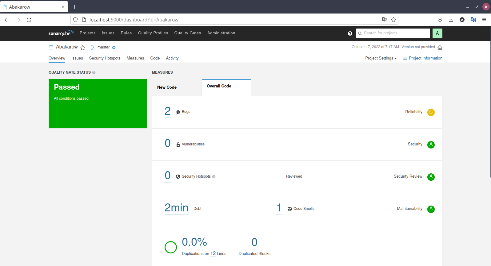
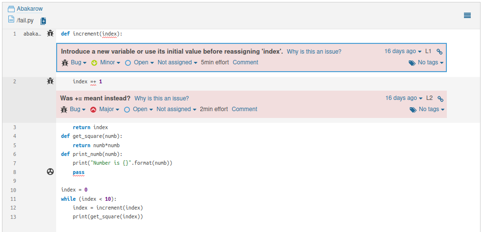
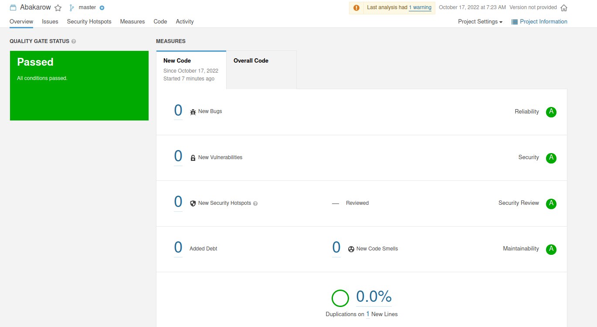
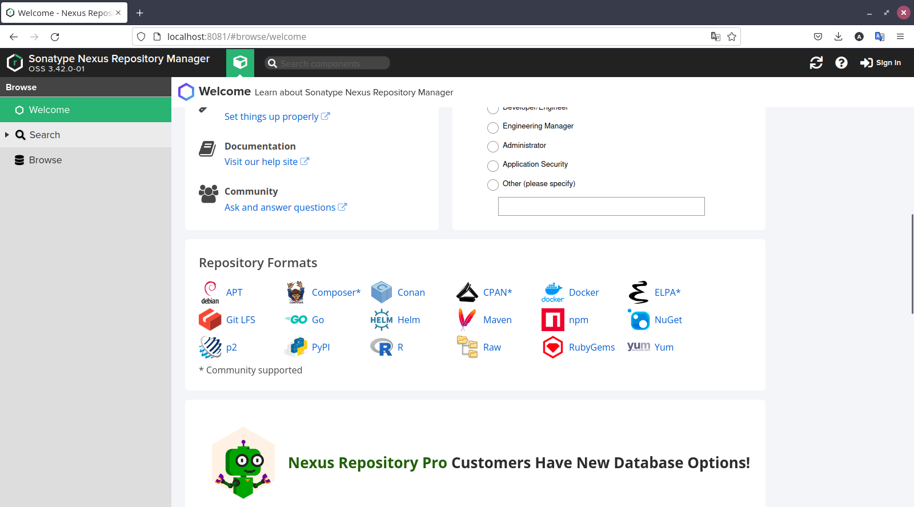
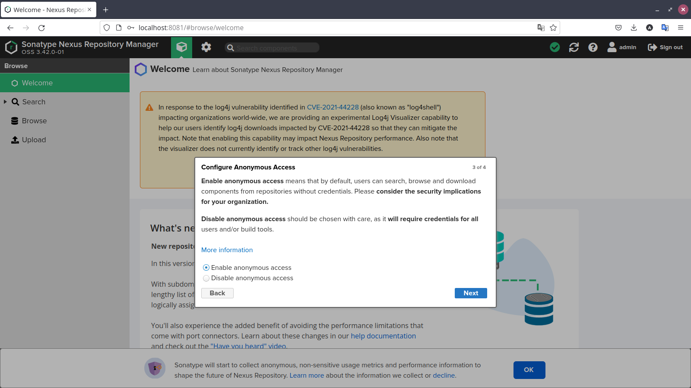
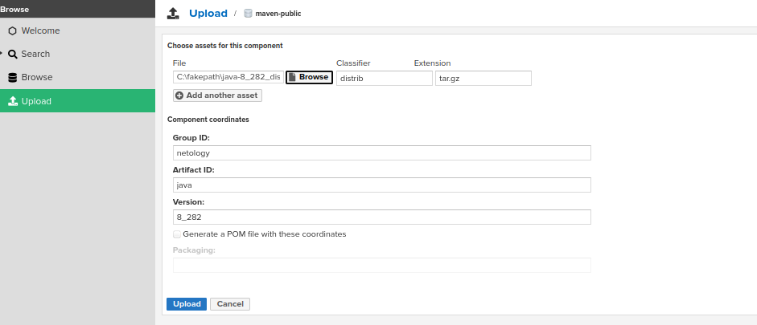
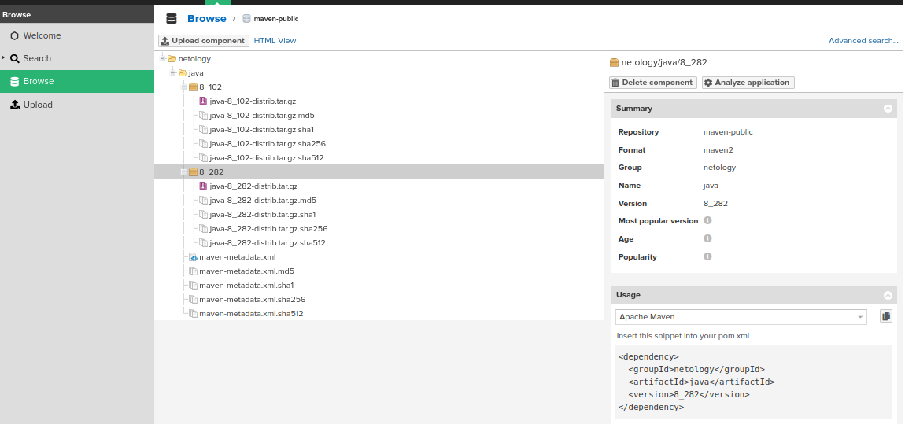

# Домашнее задание к занятию "09.02 CI\CD"

## Знакомоство с SonarQube

### Подготовка к выполнению

1. Выполняем `docker pull sonarqube:8.7-community`
2. Выполняем `docker run -d --name sonarqube -e SONAR_ES_BOOTSTRAP_CHECKS_DISABLE=true -p 9000:9000 sonarqube:8.7-community`
3. Ждём запуск, смотрим логи через `docker logs -f sonarqube`
4. Проверяем готовность сервиса через [браузер](http://localhost:9000)
5. Заходим под admin\admin, меняем пароль на свой

В целом, в [этой статье](https://docs.sonarqube.org/latest/setup/install-server/) описаны все варианты установки, включая и docker, но так как нам он нужен разово, то достаточно того набора действий, который я указал выше.

### Основная часть

1. Создаём новый проект, название произвольное
2. Скачиваем пакет sonar-scanner, который нам предлагает скачать сам sonarqube
3. Делаем так, чтобы binary был доступен через вызов в shell (или меняем переменную PATH или любой другой удобный вам способ)
### Решение
```
export PATH=$PATH:/var/lib/sonar-scanner-4.7.0.2747-linux/bin
 ```
4. Проверяем `sonar-scanner --version`
### Решение
```
ops@ops-Lenovo-G780:~$ sonar-scanner --version 
INFO: Scanner configuration file: /var/lib/sonar-scanner-4.7.0.2747-linux/conf/sonar-scanner.properties
INFO: Project root configuration file: NONE
INFO: SonarScanner 4.7.0.2747
INFO: Java 11.0.14.1 Eclipse Adoptium (64-bit)
INFO: Linux 5.15.0-50-generic amd64
```

5. Запускаем анализатор против кода из директории [example](./example) с дополнительным ключом `-Dsonar.coverage.exclusions=fail.py`
### Решение
```
ops@ops-Lenovo-G780:~/PycharmProjects/devops-netology/09-ci-02-cicd/example$ sonar-scanner   
-Dsonar.projectKey=Abakarow   
-Dsonar.sources=.   
-Dsonar.host.url=http://localhost:9000  
-Dsonar.login=4436686cab8530345637d062f8c8d8341663532f 
-Dsonar.coverage.exclusions=fail.py
```

6. Смотрим результат в интерфейсе
### Решение

7. Исправляем ошибки, которые он выявил(включая warnings)
### Решение

8. Запускаем анализатор повторно - проверяем, что QG пройдены успешно
9. Делаем скриншот успешного прохождения анализа, прикладываем к решению ДЗ
### Решение


## Знакомство с Nexus

### Подготовка к выполнению

1. Выполняем `docker pull sonatype/nexus3`
### Решение
```
ops@ops-Lenovo-G780:~$ docker pull sonatype/nexus3
Using default tag: latest
latest: Pulling from sonatype/nexus3
d5d2e87c6892: Pull complete 
008dba906bf6: Pull complete 
b4e2142a7ee0: Pull complete 
75bdf4e3eda5: Pull complete 
754b7a6e063a: Pull complete 
54fb6fd82993: Pull complete 
484f7f034926: Pull complete 
e0a41b95cd8d: Pull complete 
Digest: sha256:7e7abd3418d507d5263460eda83e239aff758cd362f8add54d9c9846cada2533
Status: Downloaded newer image for sonatype/nexus3:latest
docker.io/sonatype/nexus3:latest
```
2. Выполняем `docker run -d -p 8081:8081 --name nexus sonatype/nexus3`
### Решение
```
ops@ops-Lenovo-G780:~$ docker run -d -p 8081:8081 --name nexus sonatype/nexus3
42c974befdd3dca857bb7c529fb5002935e92b2b99f4f227753a8d62f5bbed1d
```
3. Ждём запуск, смотрим логи через `docker logs -f nexus`
### Решение
```
-------------------------------------------------

Started Sonatype Nexus OSS 3.42.0-01

-------------------------------------------------
```
4. Проверяем готовность сервиса через [бразуер](http://localhost:8081)
### Решение

5. Узнаём пароль от admin через `docker exec -it nexus /bin/bash`
### Решение
```

ops@ops-Lenovo-G780:~$ sudo docker exec -it nexus /bin/bash
bash-4.4$ cat /nexus-data/admin.password 
208ab907-9a05-4432-a397-4a56413e40aebash-4.4$ 
```


6. Подключаемся под админом, меняем пароль, сохраняем анонимный доступ

### Основная часть

1. В репозиторий `maven-public` загружаем артефакт с GAV параметрами:
   1. groupId: netology
   2. artifactId: java
   3. version: 8_282
   4. classifier: distrib
   5. type: tar.gz
2. В него же загружаем такой же артефакт, но с version: 8_102
### Решение

3. Проверяем, что все файлы загрузились успешно
### Решение

4. В ответе присылаем файл `maven-metadata.xml` для этого артефекта
### Решение
[maven-metadata.xml](https://github.com/abakarow/devops-netology/blob/main/09-ci-02-cicd/src/maven-metadata.xml)

### Знакомство с Maven

### Подготовка к выполнению

1. Скачиваем дистрибутив с [maven](https://maven.apache.org/download.cgi)
2. Разархивируем, делаем так, чтобы binary был доступен через вызов в shell (или меняем переменную PATH или любой другой удобный вам способ)
3. Проверяем `mvn --version`
4. Забираем директорию [mvn](./mvn) с pom

### Основная часть

1. Меняем в `pom.xml` блок с зависимостями под наш артефакт из первого пункта задания для Nexus (java с версией 8_282)
2. Запускаем команду `mvn package` в директории с `pom.xml`, ожидаем успешного окончания
3. Проверяем директорию `~/.m2/repository/`, находим наш артефакт
4. В ответе присылаем исправленный файл `pom.xml`

---

### Как оформить ДЗ?

Выполненное домашнее задание пришлите ссылкой на .md-файл в вашем репозитории.

---
