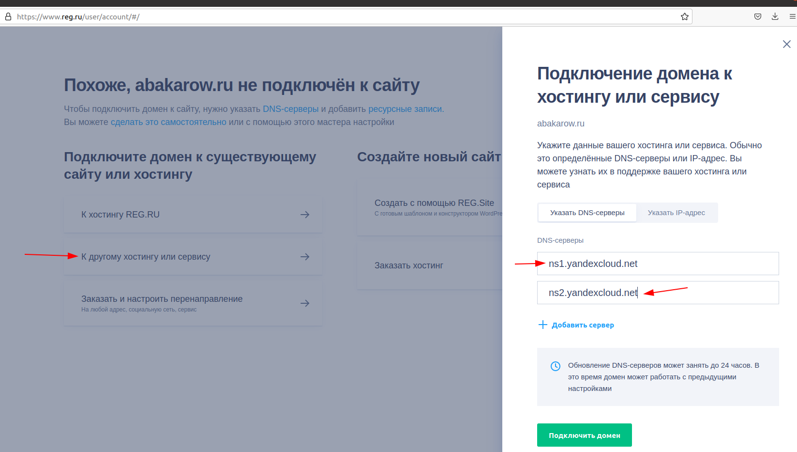
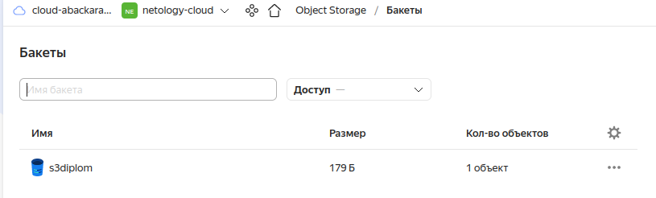
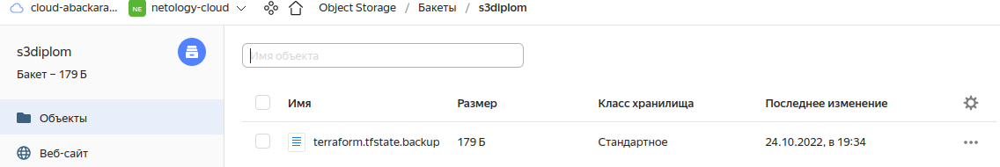
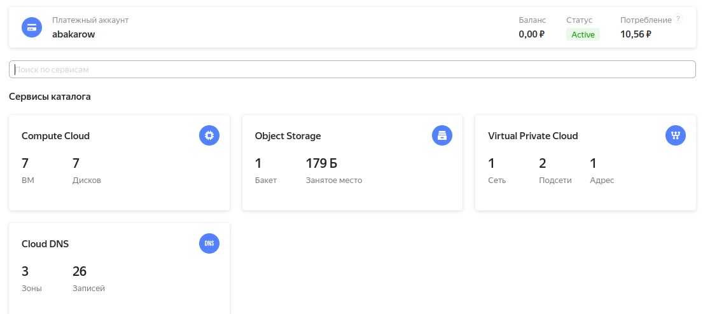
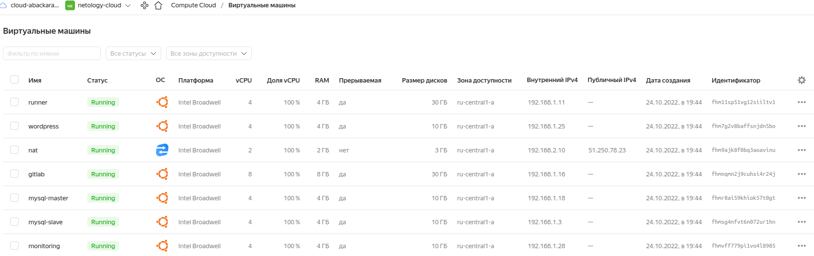
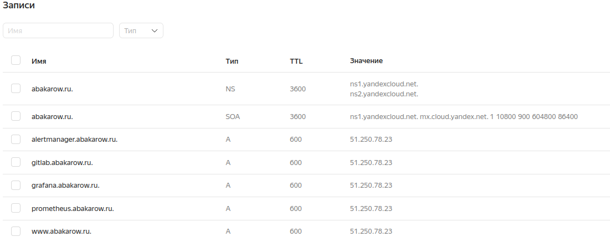
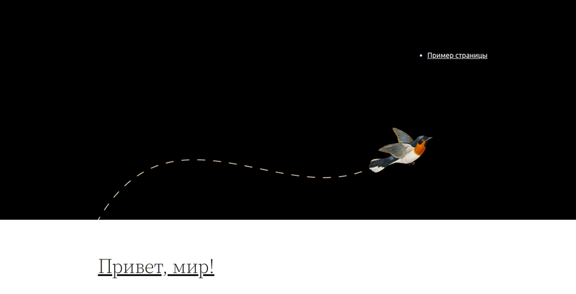
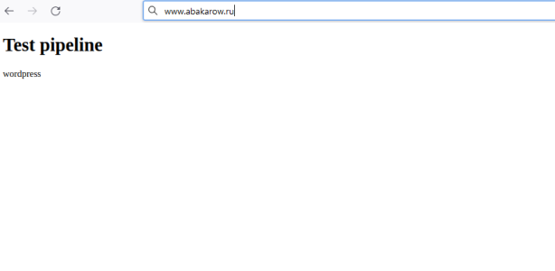

## 1. Зарегистрируем доменное имя на reg.ru

имя: abakarow.ru


## 2. Подготовка инфраструктуры

а) Создадим сервисный акк

````
ops@ops-LenovoG780:~/diploma$ yc iam service-account create --name serv
id: ajepp1es686b11dnmks4
folder_id: b1g69abn3c67tne2ms5s
created_at: "2022-10-24T16:26:03.453008080Z"
name: diplome-account
````
b) Создадим ключ авторизации для сервисного аккаунта diplome-account

````
ops@ops-LenovoG780:~/diploma$ yc iam access-key create --folder-name diplom --service-account-name diplome-account
access_key:
  id: aje4kerk11uu93stn3hl
  service_account_id: ajepp1es686b11dnmks4
  created_at: "2022-10-24T16:28:54.309035583Z"
  key_id: YCAJEcIupSfAZ8twZrKor7N1y
secret: YCNaHvFrgioula2REHv-UZoNcSiyIR12oVgy15re
````

c) Создадим ключ доступа для сервисного аккаунта

````
ops@ops-LenovoG780:~/diploma$ yc iam key create --folder-name diplom --service-account-name diplome-account --output key.json
id: aje8li7vhm1ce31ocne6
service_account_id: ajepp1es686b11dnmks4
created_at: "2022-10-24T16:29:21.386514455Z"
key_algorithm: RSA_2048

````
d) Создадим бакет 
````
ops@ops-LenovoG780:~/diploma$ alias ycs3='aws s3 --endpoint-url=https://storage.yandexcloud.net'
````

````
ops@ops-LenovoG780:~/diploma$ aws configure
AWS Access Key ID [None]: YCAJEcIupSfAZ8twZrKor7N1y
AWS Secret Access Key [None]: YCNaHvFrgioula2REHv-UZoNcSiyIR12oVgy15re
Default region name [None]: ru-central1
Default output format [None]: table
````
````
ops@ops-LenovoG780:~/diploma$ ycs3 mb s3://s3diplom
make_bucket: s3backet
````
````
ops@ops-LenovoG780:~/diploma$ ycs3 ls
2022-10-24 20:07:35 s3diplom
````


e)Подготовили backend.tf для Terraform в S3 bucket в созданном YC аккаунте.

````
terraform {
    backend "s3" {
    endpoint                    = "storage.yandexcloud.net"
    bucket                      = "s3diplom"
    region                      = "ru-central1"
    key                         = "terraform.tfstate"
    access_key = "xxx"
    secret_key = "xxx"
    skip_region_validation      = true
    skip_credentials_validation = true
  }
}
````


f) В provider.tf добавим конфигурацию провайдера yandex:
````
terraform {
  required_providers {
    yandex = {
      source  = "yandex-cloud/yandex"
      version = "0.78.1"
    }
  }
}

provider "yandex" {
  token     = var.YANDEX_TOKEN
  cloud_id  = var.YC_CLOUD_ID
  folder_id = var.YC_FOLDER_ID
  zone      = "ru-central1-a"
}
````
d) Подготовим инстансы и сеть (main.tf, network.tf)
Выполним:
````
terraform validates
terraform plan
terraform apply --auto-approve
````




## 3. Подготовка Ansible
a) ansible.cfg - для подключения к серверам (в паре с конфигом ssh)
````
[defaults]
inventory=../ansible/inventory
roles_path = ../ansible/roles 
deprecation_warnings=False
command_warnings=False
ansible_port=22
host_key_checking = False
[ssh_connection]
ssh_args = -F ./ssh_config
````
b) Установка Nginx и LetsEncrypt
reverse proxy с поддержкой TLS
````
- hosts: main
  become: yes
  become_user: root
  remote_user: ubuntu
  environment:
    LANGUAGE: en_US
    LC_ALL: en_US.UTF-8

  tasks:
    - name: Update apt packages
      apt:
        upgrade: no
        update_cache: yes

    - name: Install nginx package
      ansible.builtin.apt:
        name:
          - nginx
        state: present
        update_cache: true

    - name: Clear nginx config file
      command: truncate --size 0 /etc/nginx/sites-enabled/default

    - name: Copy nginx config content
      copy:
        dest: /etc/nginx/sites-enabled/default
        content: |
          server {
              listen 80;
              server_name www.abakarow.ru;
          
              location / {
                proxy_set_header Host $host;
                proxy_set_header X-Real-IP $remote_addr;
                proxy_set_header X-Forwarded-For $proxy_add_x_forwarded_for;
                proxy_set_header X-Forwarded-Proto $scheme;
          
                proxy_pass http://wordpress;
                proxy_read_timeout 90;
          
                proxy_redirect http://wordpress http://www.abakarow.ru;
              }
          }
          
          server {
              listen 80;
              server_name gitlab.abakarow.ru;
          
              location / {
                client_max_body_size 100m;
                
                proxy_set_header Host $host;
                proxy_set_header X-Real-IP $remote_addr;
                proxy_set_header X-Forwarded-For $proxy_add_x_forwarded_for;
                proxy_set_header X-Forwarded-Proto $scheme;
          
                proxy_pass http://gitlab:10080;
                proxy_set_header Host $host;
                proxy_read_timeout 90;
          
                proxy_redirect http://gitlab:10080 https://gitlab.abakarow.ru;
              }
          }
          
          server {
              listen 80;
              server_name grafana.abakarow.ru;
          
              location / {
                proxy_set_header Host $host;
                proxy_set_header X-Real-IP $remote_addr;
                proxy_set_header X-Forwarded-For $proxy_add_x_forwarded_for;
                proxy_set_header X-Forwarded-Proto $scheme;
          
                proxy_pass http://monitoring:3000;
                proxy_read_timeout 90;
          
                proxy_redirect http://monitoring:3000 https://grafana.abakarow.ru;
              }
          }
          
          server {
              listen 80;
              server_name prometheus.abakarow.ru;
          
              location / {
                proxy_set_header Host $host;
                proxy_set_header X-Real-IP $remote_addr;
                proxy_set_header X-Forwarded-For $proxy_add_x_forwarded_for;
                proxy_set_header X-Forwarded-Proto $scheme;
          
                proxy_pass http://monitoring:9090;
                proxy_read_timeout 90;
          
                proxy_redirect http://monitoring:9090 https://prometheus.abakarow.ru;
              }
          }
          
          server {
              listen 80;
              server_name alertmanager.abakarow.ru;
          
              location / {
                proxy_set_header Host $host;
                proxy_set_header X-Real-IP $remote_addr;
                proxy_set_header X-Forwarded-For $proxy_add_x_forwarded_for;
                proxy_set_header X-Forwarded-Proto $scheme;
          
                proxy_pass http://monitoring:9093;
                proxy_read_timeout 90;
          
                proxy_redirect http://monitoring:9093 https://alertmanager.abakarow.ru;
              }
          }
````
## 4. Установка кластера MySQL
a)  Запускаем роль кластера бд и проверим работу:
````
PLAY RECAP ************************************************************************************************************************************************************
db01.abakarow.ru     : ok=27   changed=15   unreachable=0    failed=0    skipped=0    rescued=0    ignored=0
db02.abakarow.ru     : ok=21   changed=11   unreachable=0    failed=0    skipped=0    rescued=0    ignored=0  
````
````
ubuntu@mysql-master:~$ sudo -i
root@mysql-master:~# mysql

mysql> show processlist;
+----+-----------------+----------------------------------------+------+-------------+------+-----------------------------------------------------------------+------------------+
| Id | User            | Host                                   | db   | Command     | Time | State                                                           | Info             |
+----+-----------------+----------------------------------------+------+-------------+------+-----------------------------------------------------------------+------------------+
|  5 | event_scheduler | localhost                              | NULL | Daemon      |  328 | Waiting on empty queue                                          | NULL             |
| 15 | root            | localhost                              | NULL | Query       |    0 | init                                                            | show processlist |
| 23 | replicator      | mysql-slave.ru-central1.internal:58342 | NULL | Binlog Dump |   26 | Source has sent all binlog to replica; waiting for more updates | NULL             |
+----+-----------------+----------------------------------------+------+-------------+------+-----------------------------------------------------------------+------------------+
3 rows in set (0.00 sec)

mysql> show slave hosts;
+-----------+------+------+-----------+--------------------------------------+
| Server_id | Host | Port | Master_id | Slave_UUID                           |
+-----------+------+------+-----------+--------------------------------------+
|         2 |      | 3306 |         1 | 937d6da6-3c1d-11ed-89cf-d00d92e854aa |
+-----------+------+------+-----------+--------------------------------------+
1 row in set, 1 warning (0.00 sec)
````

````
mysql> show slave status\G
*************************** 1. row ***************************
               Slave_IO_State: Waiting for source to send event
                  Master_Host: mysql-master
                  Master_User: replicator
                  Master_Port: 3306
                Connect_Retry: 60
              Master_Log_File: mysql-bin.000002
          Read_Master_Log_Pos: 1539
               Relay_Log_File: mysql-relay-bin.000002
                Relay_Log_Pos: 1126
        Relay_Master_Log_File: mysql-bin.000002
             Slave_IO_Running: Yes
            Slave_SQL_Running: Yes
              Replicate_Do_DB: 
          Replicate_Ignore_DB: 
           Replicate_Do_Table: 
       Replicate_Ignore_Table: 
      Replicate_Wild_Do_Table: 
  Replicate_Wild_Ignore_Table: 
                   Last_Errno: 0
                   Last_Error: 
                 Skip_Counter: 0
          Exec_Master_Log_Pos: 1539
              Relay_Log_Space: 1336
              Until_Condition: None
               Until_Log_File: 
                Until_Log_Pos: 0
           Master_SSL_Allowed: No
           Master_SSL_CA_File: 
           Master_SSL_CA_Path: 
              Master_SSL_Cert: 
            Master_SSL_Cipher: 
               Master_SSL_Key: 
        Seconds_Behind_Master: 0
Master_SSL_Verify_Server_Cert: No
                Last_IO_Errno: 0
                Last_IO_Error: 
               Last_SQL_Errno: 0
               Last_SQL_Error: 
  Replicate_Ignore_Server_Ids: 
             Master_Server_Id: 1
                  Master_UUID: 3744182e-3c1d-11ed-bad2-d00d20f7b233
             Master_Info_File: mysql.slave_master_info
                    SQL_Delay: 0
          SQL_Remaining_Delay: NULL
      Slave_SQL_Running_State: Replica has read all relay log; waiting for more updates
           Master_Retry_Count: 86400
                  Master_Bind: 
      Last_IO_Error_Timestamp: 
     Last_SQL_Error_Timestamp: 
               Master_SSL_Crl: 
           Master_SSL_Crlpath: 
           Retrieved_Gtid_Set: 
            Executed_Gtid_Set: 
                Auto_Position: 0
         Replicate_Rewrite_DB: 
                 Channel_Name: 
           Master_TLS_Version: 
       Master_public_key_path: 
        Get_master_public_key: 0
            Network_Namespace: 
1 row in set, 1 warning (0.00 sec)
````
## 5. Установка WordPress

a) Запустим роль:

````
- hosts: wordpress
  become: yes
  become_user: root
  remote_user: ubuntu
  environment:
    LANGUAGE: en_US
    LC_ALL: en_US.UTF-8

  tasks:
    - name: Update apt packages
      apt:
        upgrade: no
        update_cache: yes

    - name: Install apache2, mysql, php and other packages
      ansible.builtin.apt:
        name:
          - apache2
          - ghostscript
          - libapache2-mod-php
          - mysql-server
          - php
          - php-bcmath
          - php-curl
          - php-imagick
          - php-intl
          - php-json
          - php-mbstring
          - php-mysql
          - php-xml
          - php-zip
        state: present
        update_cache: true

    - name: Chmod /var/www
      ansible.builtin.file:
        path: /var/www
        owner: www-data

    - name: Download WordPress actual version
      shell:
        cmd: curl https://wordpress.org/latest.tar.gz | sudo -u www-data tar zx -C /var/www

    - name: Create wordpress config file
      copy:
        dest: /etc/apache2/sites-available/wordpress.conf
        content: |
          <VirtualHost *:80>
            DocumentRoot /var/www/wordpress
            <Directory /var/www/wordpress>
              Options FollowSymLinks
              AllowOverride Limit Options FileInfo
              DirectoryIndex index.php
              Require all granted
            </Directory>
            <Directory /var/www/wordpress/wp-content>
              Options FollowSymLinks
              Require all granted
            </Directory>
          </VirtualHost>
    - name: a2ensite wordpress
      command: a2ensite wordpress

    - name: a2enmod rewrite
      command: a2enmod rewrite

    - name: a2dissite 000-default
      command: a2dissite 000-default

    - name: Restart apache2 daemon
      systemd:
        name: apache2
        state: restarted
        enabled: yes

    - name: Copy WordPress config file
      command: sudo -u www-data cp /var/www/wordpress/wp-config-sample.php /var/www/wordpress/wp-config.php

    - name: Update WordPress host
      command: sudo -u www-data sed -i 's/localhost/mysql-master/' /var/www/wordpress/wp-config.php

    - name: Update WordPress database
      command: sudo -u www-data sed -i 's/database_name_here/wordpress/' /var/www/wordpress/wp-config.php

    - name: Update WordPress username
      command: sudo -u www-data sed -i 's/username_here/wordpress/' /var/www/wordpress/wp-config.php

    - name: Update WordPress password
      command: sudo -u www-data sed -i 's/password_here/wordpress/' /var/www/wordpress/wp-config.php

    - name: Add `WP_SITEURL` to Wordpress config
      lineinfile:
        path: /var/www/wordpress/wp-config.php
        line: define( 'WP_HOME');

    - name: Add `WP_SITEURL` to Wordpress config
      lineinfile:
        path: /var/www/wordpress/wp-config.php
        line: define( 'WP_SITEURL');


    - name: Include Docker task from `common` role
      include_role:
        name: common
        tasks_from: docker

    - name: Include Node exporter task from `common` role
      include_role:
        name: common
        tasks_from: node-exporter
````



## 6. Установка Gitlab CE и Gitlab Runner
а) Запуск роли:
````
PLAY RECAP ************************************************************************************************************************************************************
gitlab.abakarow.ru   : ok=15   changed=13   unreachable=0    failed=0    skipped=0    rescued=0    ignored=0   
runner.abakarow.ru   : ok=11   changed=8    unreachable=0    failed=0    skipped=0    rescued=0    ignored=0  
````
Создание run: 

````
root@runner:~# gitlab-runner register
Runtime platform                                    arch=amd64 os=linux pid=7598 revision=43b2dc3d version=15.4.0
Running in system-mode.                            
                                                   
Enter the GitLab instance URL (for example, https://gitlab.com/):
http://gitlab:10080
Enter the registration token:
GR13489414zVm1aSAHvgsC4SmxS1i
Enter a description for the runner:
[runner]: wordpress
Enter tags for the runner (comma-separated):
wordpress
Enter optional maintenance note for the runner:
wordpress
Registering runner... succeeded                     runner=GR13489414zVm1aSA
Enter an executor: docker+machine, docker-ssh+machine, kubernetes, custom, parallels, shell, virtualbox, docker, docker-ssh, ssh:
ssh
Enter the SSH server address (for example, my.server.com):
wordpress
Enter the SSH server port (for example, 22):
22
Enter the SSH user (for example, root):
ubuntu
Enter the SSH password (for example, docker.io):

Enter the path to the SSH identity file (for example, /home/user/.ssh/id_rsa):
/root/.ssh/id_rsa
Runner registered successfully. Feel free to start it, but if it's running already the config should be automatically reloaded!
 
Configuration (with the authentication token) was saved in "/etc/gitlab-runner/config.toml" 
````
b) Cоздадим pipeline-файл .gitlab-ci.yml:
````
deploy-job:
  stage: deploy
  script:
    - echo "Deploy" 
    # Upload to server
    - rsync -vz  ./* /var/www/wordpress/
    - rm -rf /var/www/wordpress/.git
    # Provide file permissions
    - sudo chown -R www-data /var/www/wordpress/
````
c) На выходе получим:



## Мониторинг
а) Запустим роль зазворачивающую мониторинг
